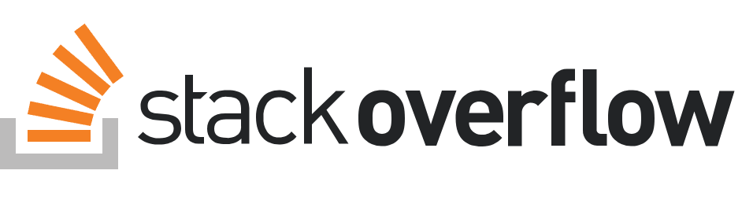

# 프로젝트 이름

   
  
   

## 목차

## 프로젝트 소개

CodeStates에서 41st - 25th team Pre Project로 진행한 프로젝트입니다.

### 프로젝트 기간
2022.12.16 ~ 2023.01.04

### 프로젝트 구조

 

## 팀원 소개

### FE

|   위현우    |   이현지    |   김리안    |
|:--------:|:--------:|:--------:|
| ![react] | ![react] | ![react] |

### BE

|                   유형찬                   |                   채승윤                   |                   박종혁                    |
|:---------------------------------------:|:---------------------------------------:|:----------------------------------------:|
|                ![spring]                |                ![spring]                |                ![spring]                 |
| [Github](https://github.com/gudcks0305) | [Github](https://github.com/orioncsy) | [Github](https://github.com/pjongk148 ) |

## 기술 스택

| JavaScript |  java   |  React   |  spring   |
|:----------:|:-------:|:--------:|:---------:|
|   ![js]    | ![java] | ![react] | ![spring] |

### 문서

[API 문서](https://server.prestack41-25.kro.kr/docs/index.html)

[테이블 정의서](https://docs.google.com/spreadsheets/d/1BBenLhqlpUmjgY6uC2ZhaJwrMxluj4H9bhJA7o0io0U/edit#gid=0)

[ERD](https://www.erdcloud.com/d/vWN9S58QNkiv6pxd2)

[요구사항 정의서](https://docs.google.com/spreadsheets/d/11e0y3NLAZAIWfjTgWVdka0D4ATXGKdJCLKn7mrw0buc/edit#gid=0)

[화면 구성](https://www.figma.com/file/i0De5WDtvU4P5y9dS8XBeM?embed_host=notion&kind=&node-id=0%3A1&t=oWsMsd2Llu0VRvnp-0&viewer=1)
### 배포 주소 
[Client](https://client.prestack41-25.kro.kr/)

[Server](https://server.prestack41-25.kro.kr/)

## 배운 점 & 아쉬운 점

## 라이센스

MIT 

<!-- Stack Icon Refernces -->

[js]: /images/stack/javascript.svg

[java]: /images/stack/java.svg

[react]: /images/stack/react.svg

[spring]: /images/stack/spring.svg
